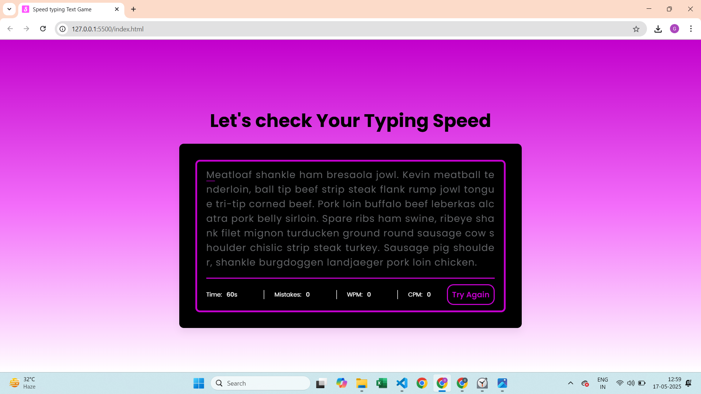
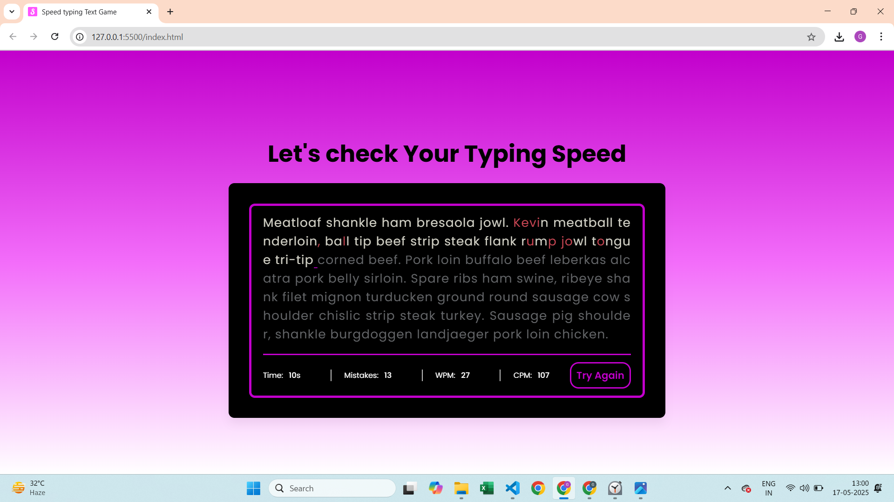
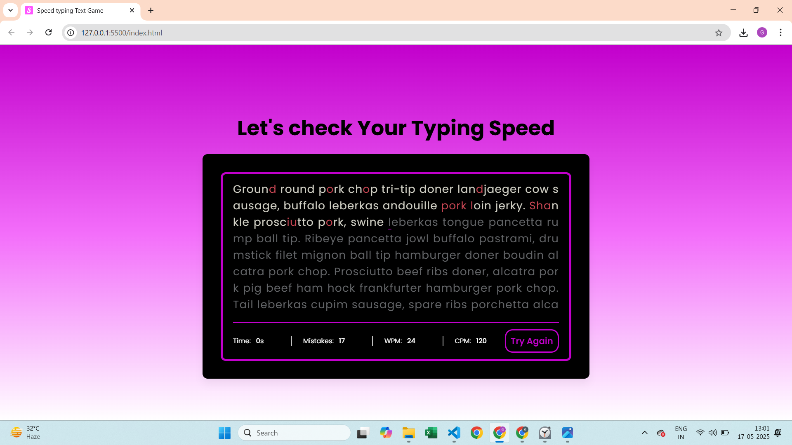

# 💨 Speed Typing Game


A fun and interactive typing game built with HTML, CSS, and JavaScript. Test your typing speed and accuracy against the clock ⏱️ and try to beat your high score!

## 🚀 Features

- 🧠 Random word generation
- ⏳ Countdown timer
- 📈 Live score tracking
- 🔄 Game over + restart functionality
- 📱 Clean, responsive user interface

## 🌐 Live Demo
👉 [Play Now](https://mohitgundal.github.io/Speed-Typing-Game/)

## 📸 Screenshots
## 🏠 Home Screen

## ⌨️ Typing in Progress

## ✅ Results Screen


### 🎥 Demo in Action


## 🧰 Tech Stack

- HTML
- CSS
- JavaScript

## 💻 How to Run Locally

1. **Clone this repository:**
   ```bash
   git clone https://github.com/mohitgundal/speed-typing-game.git
   ```

2. **Navigate into the project directory:**
   ```bash
   cd speed-typing-game
   ```

3.  **Open `index.html`:**
    Locate the `index.html` file within the project directory and open it with your preferred web browser (e.g., Chrome, Firefox, Edge).
    No local server setup is required as this is a front-end only application.
   ---


## 📁 Project Structure
```plaintext
/
├── index.html        # The main HTML file, structuring the game and content.
├── style.css        # Contains all the CSS rules for styling the UI, animations, and responsive design.
├── script.js        # The core JavaScript file, handling the game logic, timers, score tracking, and user interactions.
├── images/          # Directory for project-related image assets.
├── logo.png         # The custom favicon displayed in the browser tab.
└── README.md        # This file
```


## 🤝 Contributing
Contributions are welcome!
Feel free to fork this repo, improve the game, and open a pull request.
You can also raise issues or suggest new features 💡


## 📜 License
Licensed under the MIT License – see LICENSE for more details.


## 🙋‍♂️ Author
Made with 💙 by **Mohit Gundal**  
Let’s connect on [LinkedIn](https://www.linkedin.com/in/mohitgundal)


## 🙏 Thank you for checking this out!
If you liked it, consider giving a ⭐ to the repository 😊

```

